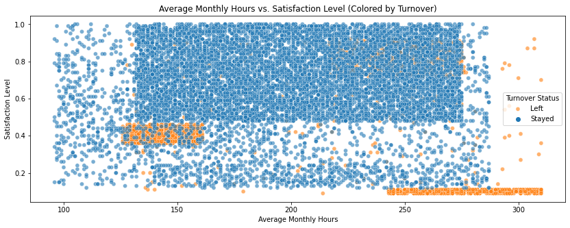
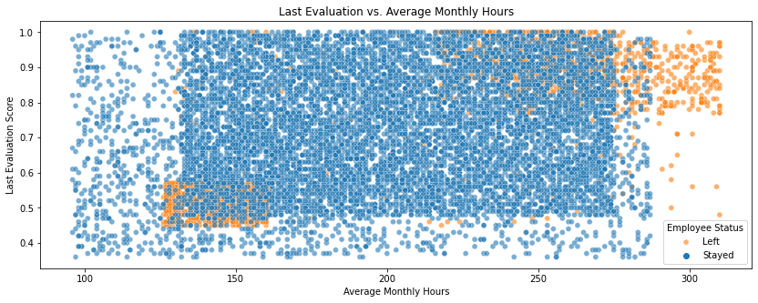
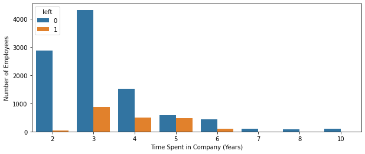
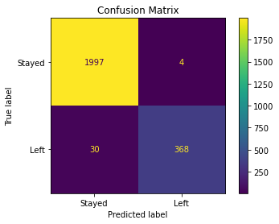
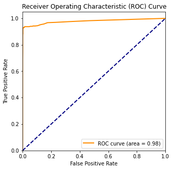
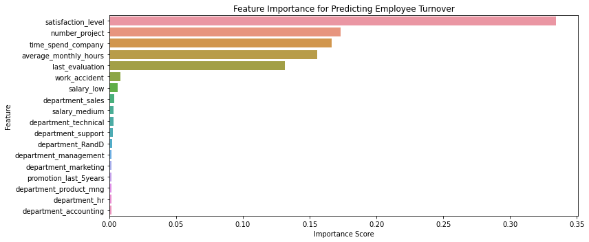

# Employee Turnover Analysis and Prediction for Salifort Motors

## Project Overview

This project analyzes a dataset from Salifort Motors, a vehicle manufacturer experiencing a high rate of employee turnover. The goal is to identify the key factors driving attrition and to build a predictive model that can identify employees at high risk of leaving. By understanding the "why" behind turnover, we can provide data-driven recommendations to leadership to improve employee retention, boost morale, and reduce the financial costs associated with hiring and training replacements.

This analysis follows the **PACE (Plan, Analyze, Construct, Execute)** data analysis framework to ensure a structured and comprehensive approach.

---

## Key Questions

1.  What are the main factors that drive employee turnover?
2.  Can we identify the key characteristics of employees who leave versus those who stay?
3.  Can we build a reliable model to predict which employees are at the highest risk of leaving?
4.  What actionable recommendations can be derived from this analysis to help leadership reduce turnover?

---

## Exploratory Data Analysis (EDA) - Key Findings

The initial analysis of the data revealed several critical insights into the dynamics of employee turnover at Salifort Motors.

### 1. Distinct Profiles of Employees Who Leave

A key finding is that employees who leave are not a single, homogeneous group. They fall into three distinct clusters, which are best visualized by plotting their `satisfaction_level` against their `average_monthly_hours`.

* **Cluster 1: The Unhappy and Under-Engaged** (Bottom-Left): These employees have very low satisfaction levels (< 0.2) and work fewer hours than average. They are likely disengaged from their work.
* **Cluster 2: The Burned-Out and Over-Worked** (Top-Left): These employees work an unsustainable number of hours (250+) and leave despite having moderate to high satisfaction levels. This is a clear sign of burnout.
* **Cluster 3: The Stable Core** (Center): Employees who stay tend to have a healthy balance of work hours and higher satisfaction levels.

A similar pattern emerges when plotting `last_evaluation` scores against `average_monthly_hours`, confirming that the company is losing both its under-performers and its overworked high-performers.

### 2. The Critical 3-5 Year "Danger Zone"

The data shows that turnover risk is not linear with tenure. Instead, it peaks dramatically for employees who have been with the company for 3 to 5 years. This identifies a critical window for targeted retention efforts.

---

## Predictive Modeling

### Model Selection

Two models were built and evaluated for this binary classification task: a **Logistic Regression** model as a baseline and a **Random Forest Classifier**.

The Random Forest model was selected as the final model due to its significantly superior performance, especially its ability to handle the complex, non-linear relationships we discovered in the EDA.

### Model Performance

The final Random Forest model performed exceptionally well on the unseen test data.

| Metric                 | Score | Interpretation                                                                                        |
| ---------------------- | :---: | ----------------------------------------------------------------------------------------------------- |
| **Accuracy** |  99%  | The model is correct in its predictions 99% of the time.                                              |
| **Recall (for "Left")**|  92%  | The model successfully identifies 92% of all employees who will actually leave.                         |
| **Precision (for "Left")**| 99% | When the model predicts an employee will leave, it is correct 99% of the time.                         |
| **AUC Score** | 0.98  | The model has an outstanding ability to distinguish between employees who will leave and those who will stay. |

---

## Key Drivers of Turnover

The model's feature importance analysis allowed us to identify and rank the key factors that predict turnover.

The top 5 most important drivers are:
1.  **Satisfaction Level**
2.  **Time Spent in Company (Tenure)**
3.  **Number of Projects**
4.  **Average Monthly Hours**
5.  **Last Evaluation Score**

This confirms that an employee's satisfaction and their daily work experience (workload, tenure, and performance) are the most critical factors influencing their decision to leave.

---

## Business Recommendations

Based on these data-driven insights, the following recommendations are proposed:

1.  **Prioritize Employee Satisfaction:** Make improving employee satisfaction a top strategic goal. Implement regular "pulse" surveys to monitor morale and invest in management training focused on creating a positive and supportive work environment.
2.  **Address Burnout and Engagement:** Create distinct strategies for the two at-risk employee profiles. Protect top performers from burnout with workload management and re-engage under-performers with clear development plans and regular one-on-ones.
3.  **Implement a Mid-Tenure Retention Program:** Develop a targeted retention program for employees with 3 to 5 years of tenure. This should include creating clear career paths and offering new learning opportunities to re-engage these experienced employees.
4.  **Deploy the Predictive Model as a Proactive Tool:** Use the model to generate employee "risk scores," allowing HR to offer proactive support and targeted interventions to those most likely to leave *before* they resign.

---

## Repository Structure
